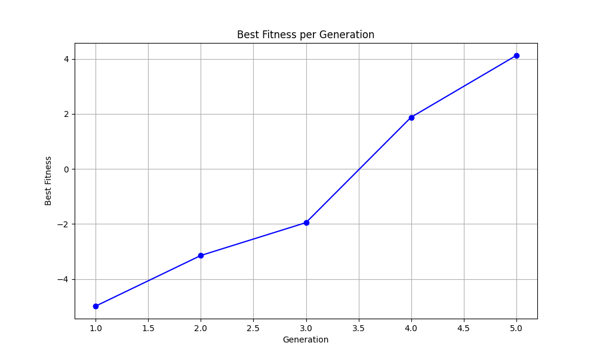

# NU-CS396-ALife: Artificial Life Coursework

This repository contains the homework assignments for the NU-CS396-ALife course, focusing on the simulation and study of artificial life. Each homework is designed to progressively build upon the concepts of simulating life-like behaviors and characteristics in a digital environment.

# Final Project: Evolutionary Simulation Project Report

## Project Overview

This project aims to incorporate selection into our MuJoCo-based simulation's evolutionary algorithm framework, completing the essential elements for evolution: heredity, variation, and selection. The focus was to evolve entities that could achieve greater distances, adhering to the evolutionary principle where entities that are faster or can travel further are more likely to survive and reproduce.

## Evolutionary Process

We initiated the simulation with entities capable of random movements. These entities were defined with bodies and wings that could mutate in terms of size, mass, and actuator gear strength. The entities' fitness was evaluated based on the distance each could travel.

## Challenges and Strategies

Throughout the simulation, we faced and addressed several challenges:

### Simulation Instability

Initial generations of the simulation were plagued with instability issues. These were characterized by extreme mutations, leading to non-viable entities that were represented by `NaN`, `Inf`, or excessively large values in the simulation outputs.

### Unrealistic Positive Feedback

As the generations progressed, an unrealistic positive feedback loop was observed. Entities with higher fitness scores tended to receive more extreme mutations, which often led to even higher fitness scores but were not reflective of realistic or stable entities.

### Implemented Solutions

To tackle the challenges mentioned above, we introduced the following strategies:

1. **Mutation Constraints**: We imposed realistic bounds on the mutations to prevent extreme changes.
2. **Fitness Evaluation Checks**: Sanity checks were added to the fitness evaluation to ensure that only viable entities influenced the evolutionary outcomes.
3. **Dynamic Mutation Rates**: We incorporated dynamic mutation rates that were inversely proportional to the entity's fitness score, promoting fine-tuning for high-performing entities.
4. **Graphical Analysis**: We added a graph to visualize the fitness across generations to better understand the mutation dynamics.

## Results

### Progression Log

The fitness log for five generations indicated a positive trend in the entities' ability to move. Starting with negative fitness scores, the entities' capabilities improved through generations, culminating in positive scores and more effective movement strategies.

### Graphical Analysis

The graphical representation of fitness across generations showed a clear upward trajectory, confirming the effectiveness of the evolutionary principles applied.




## Evolutionary Adaptations

In the most successful generation, the creatures adapted to have one short limb and one long limb, leading to an unexpected proficiency in vertical movement. The evolved parameters indicate significant limb asymmetry, with differences in limb sizes and masses suggesting a rotational motion aiding their vertical movement. This asymmetry and the specialized mass distribution, along with finely-tuned actuator gears, underline an efficient vertical travel mechanism within the simulation environment.

## Conclusion and Future Directions

The project was successful in integrating the essential elements of evolution into the simulation software. The adjustments made have guided the evolution of entity mobility towards more realistic and effective behaviors.

Future work will aim to further refine the evolutionary algorithm. This may involve exploring more complex mutation strategies and introducing additional selection criteria such as energy efficiency or agility. Expanding the graphical analysis to incorporate more behavioral data will also be considered to provide a deeper understanding of the evolutionary outcomes.

In summary, this project has established a solid foundation for simulating evolution and the emergence of complex, adaptive behaviors in a controlled digital environment.


# Past Homework Assignments

### Homework 1: Basic Simulation

- **Objective**: Introduce a basic body structure into the simulation.
- **Tasks**:
  1. Create a simulated body.
  2. Implement movement capabilities for the body.

### Homework 2: Genotype to Phenotype Mapping

- **Objective**: Implement the directed graph genotype-to-phenotype conversion for creating 3D creatures, as described in Karl Sims's paper "Evolving 3D Morphology and Behavior by Competition."
- **Tasks**:
  1. Develop the genotype-to-phenotype mapping for 3D creature creation.

### Homework 3: Fitness Function and Iterative Simulation

- **Objective**: Optimize the fitness function to prioritize distance traveled and reduce the penalty for instability.
- **Tasks**:
  1. Modify the fitness function to favor distance more significantly and lessen stability penalties.
  2. Utilize parameters with the highest fitness scores from previous iterations as a baseline for subsequent iterations.
  3. Execute batch simulations for randomly generated configurations and evaluate their fitness.

- **Simulation Execution and Results**:
  - Run the generator script for each batch of configurations:
    ```
    python generator.py
    ```
  - Sample output (showing fitness scores for different bodies):
    ```
    Body 0 Fitness: 0.523
    Body 1 Fitness: 0.269
    ...
    Body 8 Fitness: 0.657
    ...
    Body 9 Fitness: 0.140
    ...
    Body 6 Fitness: 0.878
    ...
    Body 9 Fitness: 0.947
    ```

### Homework 4: Evolutionary Mutations and Stability

- **Objective**: Implement mutations in the physical attributes of the simulated bodies to explore the impact on fitness, focusing on mutations to body and wing sizes and masses.
- **Tasks**:
  1. Introduce mutations to the body and wing sizes and masses.
  2. Evaluate the impact of these mutations on the fitness scores across generations.
  3. Address simulation stability issues arising from extreme mutations.

- **Simulation Execution and Results**:
  - Run the generator script for evolutionary mutations:
    ```
    python generator.py
    ```
  - Observed results across 5 generations showed progressive improvements in fitness scores, with the best fitness due to mutations being notably higher in each subsequent generation. However, extreme mutations led to simulation instability in some instances, evidenced by `Nan`, `Inf`, or huge value warnings from the physics engine. These issues underscore the delicate balance between exploring the parameter space for optimal configurations and maintaining realistic, stable simulations.

- **Commentary on Simulation Stability**:
  - The evolutionary process led to both impressive improvements in fitness scores and instances of simulation instability. Particularly in Generation 4 and Generation 5, we observed `Nan`, `Inf`, or huge value warnings, highlighting the challenges of managing mutation magnitudes. This serves as a critical reminder of the importance of constraining mutations within realistic bounds and implementing mechanisms to detect and mitigate simulation instability. Future work will focus on refining mutation strategies to enhance simulation robustness while continuing to explore the parameter space for performance optimization. These issues will be addressed and hopefully resovled in Final Project submission.

 
